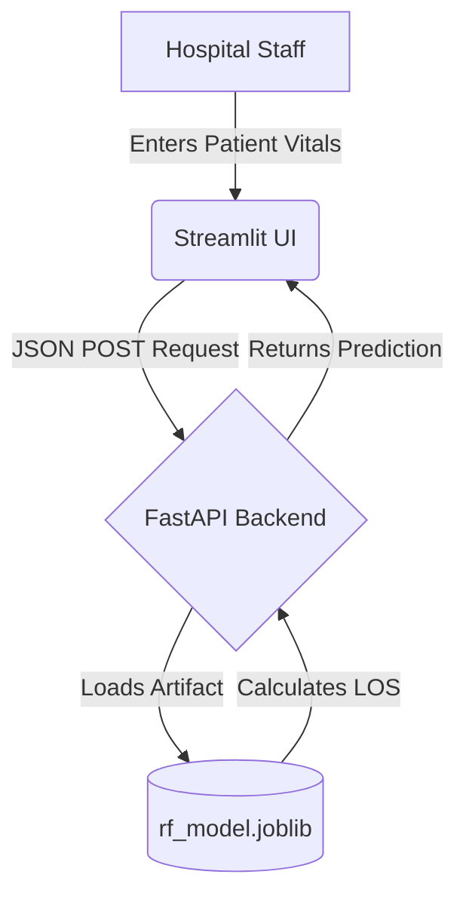

# Hospital Resource Optimization & Length of Stay Predictor

A production-ready machine learning system built to predict patient hospital length of stay (LOS) at the time of admission, aiding hospital bed management and resource allocation.

## System Architecture

## Tech Stack
- **Language:** Python
- **Core ML:** Scikit-Learn, XGBoost, Pandas, NumPy, SHAP
- **Backend API:** FastAPI, Uvicorn
- **Frontend UI:** Streamlit
- **Model Artifacts:** Joblib

## Key Features & Engineering Rigor
- **Data Leakage Prevention:** Explicitly dropped discharge dates and post-admission features to ensure real-world viability at the moment of admission.
- **Model Performance:** Compared Linear Regression baseline against a tuned Random Forest Regressor, improving $R^2$ from 0.768 to 0.817 and reducing MAE to 0.77 days.
- **Handling Medical Imbalance:** Built an XGBoost classifier for Renal Disease risk, utilizing `scale_pos_weight` to prioritize Recall (0.75) over plain accuracy, catching 89% more at-risk patients than the baseline.
- **Explainability:** Used SHAP values to identify prior visit counts (`rcount`) and facility type (`facid_E`) as primary drivers of extended stays.